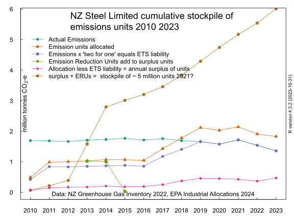

## New Zealand Steel Limited free industrial allocation of emissions units 2010 to 2021

### If it's worth paying New Zealand Steel to reduce emissions shouldn't we first stop paying them to increase emissions?

The Government made an extremely exaggerated announcement on Sunday 21 May 2023 that it will contribute $140 million to a New Zealand Steel project to electrify (replace coal thermal heat) their steel and iron recycling process. Thus reducing future emissions of greenhouse gases.

NZ’s biggest ever emissions reduction project unveiled the title breathlessly gushed.

If only the hyperbole flowing from the joint Government and Te Tari Tiaki Pūngao/EECA announcement matched the appalling reality of how dysfunctional the overall picture of New Zealand Steel's treatment is under the emissions trading scheme.

New Zealand Steel has never faced an emissions price under the emissions trading scheme.

In every year since 2010, New Zealand Steel has been allocated far more free emissions units than the number it has had to surrender back to the Government. In each year there is an annual surplus of units.

Here is a chart of the allocated emissions units and the estimated liability to surrender units under the emissions trading scheme

 

The effect of the excessively generous allocation of units is to completely insulate New Zealand Steel from an emissions price.

Notwithstanding this extremely generous subsidy, back in 2012 and 2013 New Zealand Steel still engaged in [windfall arbitrage profiteering](http://bit.ly/1TQUr5C) by buying dirt cheap international hot air emissions units. The point being that New Zealand Steel did not need any additional units to surrender as the allocation of units already exceeded the liability to surrender units in those two years.

The annual amount of free emissions units allocated is [proportional to the steel production](https://www.beehive.govt.nz/release/revised-ets-balances-nz%E2%80%99s-environment-economy). If production and emissions increase, the amount of free emission units allocated increases.

Conversely, if steel production and emissions decline, the amount of free emission units decreases. Free allocation of emission units incentivises increased emissions. And disincentivises reduced emissions.

New Zealand Steel has been allocated a total of 16 million emission units between 2010 to 2021. This is the Government paying New Zealand Steel to emit greenhouse gas.

New Zealand's emissions units now have an enhanced value due to the 2020 amendments to the Climate Change Response Act.

This is a chart of the annual values of the New Zealand Steel unit allocations when priced with a mean May price. May is the month when the units are transferred to New Zealand Steel's ownership.

The 16 million emissions units allocated to New Zealand Steel have a total value of $308 million. The proposed grant to reduce steel recycling emissions by electrification, is $140 million.

New Zealand Steel has already been paid twice as much money ($308 million) to maintain it's emissions, as the value of the proposed electrification grant ($140 million). 

If it's worth paying New Zealand Steel to reduce emissions shouldn't we first stop paying them to increase emissions?

### Should a major emitter like New Zealand Steel Limited be accumulating a stockpile of emissions units under the emissions trading scheme?

Every year since the [New Zealand Emissions Trading Scheme](https://www.epa.govt.nz/industry-areas/emissions-trading-scheme/) began, [New Zealand Steel Limited](https://en.wikipedia.org/wiki/New_Zealand_Steel) has received more emissions units under the Emissions Trading Scheme [Industrial Allocation](https://www.epa.govt.nz/industry-areas/emissions-trading-scheme/industrial-allocations/) rules then it has had to [surrender](https://www.epa.govt.nz/industry-areas/emissions-trading-scheme/participating-in-the-ets/surrendering-units/) to the Government for it's emissions.

Should the emissions trading scheme result in New Zealand Steel accumulating a stockpile of emissions units? In a sensibly designed emissions trading scheme, shouldn't the net 'flow' of emissions units be from the emitter, New Zealand Steel, to the Government? And not from the Government to the emitter?

Here is a graph of the greenhouse gas emissions of the New Zealand steel sector from the [Greenhouse Gas Inventory](https://environment.govt.nz/publications/new-zealands-greenhouse-gas-inventory-1990-2020/). The emissions do not vary much over time. I assume that is because production in the steel smelter is also consistent from year to year.

 

I know these emissions are from the New Zealand Steel Limited's steel smelting plant in Glenbrook as I looked up New Zealand Steel's actual 2020 emissions in the EPA report ["ETS Participant Emissions"](https://www.epa.govt.nz/industry-areas/emissions-trading-scheme/ets-reports/emissions-returns/) October 2021. New Zealand Steel's reported emissions are (steel 54,431 + stationary energy 762,038 + coal purchase 736,875 equals) 1,553,344 tonnes.

I have marked that data point with a purple point. The [2020 Greenhouse Gas Inventory](https://environment.govt.nz/publications/new-zealands-greenhouse-gas-inventory-1990-2020/) steel emissions are 1,578,554; the green point. The purple and green data points overlap on the graph. So I think it's reasonable to use the GHG Inventory steel industry emissions as an estimate of New Zealand Steel's actual emissions from 1990 to 2020.

In October 2022, the Environmental Protection Authority published ["ETS Participant Emissions"](https://www.epa.govt.nz/assets/Uploads/Documents/Emissions-Trading-Scheme/Reports/Emissions-returns/Participant-Emissions-Report.pdf) for the calendar year 2021.

In that report, as in 2020, New Zealand Steel's emissions are split between three categories; 1) "Importing coal" 989,459 tonnes page 17, 2) "Producing iron or steel" 43,466 tonnes page 21, 3) "Stationary energy purchasing coal" 856,363 tonnes page 33.

So 43466 + 989459 + 856363 = 1889288 tonnes or 1,889,288 tonnes of emissions from the steel smelter for 2021. I have again marked the point with a purple point.

Here is the same graph but with the [industrial allocation](https://web.archive.org/web/20121211052612/http://www.climatechange.govt.nz/emissions-trading-scheme/participating/industry/allocation/how-it-works/) of free emissions units added.

The free emissions units don't seem to relate logically to the steel emissions. The free units seem to be roughly half of the emissions until 2016 then the free units increase anually until they are greater than the emissions in years 2018, 2019 and 2020 and 2021. What's going on?

There is another variable to take into account. It is the the [Nick Smith '1 for 2' surrender obligation of 2009](https://environment.govt.nz/publications/emissions-trading-bulletin-no-11-summary-of-the-proposed-changes-to-the-nz-ets/summary/) which halved the unit surrender liability of emitters. Meaning they were required to surrender 1 unit for two tonnes of emissions (Or half a unit per tonne).

 

Prior to 2017, non-forestry participants in the ETS had to surrender one eligible unit for every two tonnes of emissions. A "one for two" deal. This discount was phased out from 2017; 1 unit for each 1.5 whole tonnes of emissions, 2018; - 1 unit for each 1.2 whole tonnes of emissions. And finally in 2019; the ETS gets to 1 unit for each 1 whole tonne of emissions.

So I need to factor in the discount to estimate the actual liability to surrender units under the Emissions Trading Scheme. That is steel emissions multiplied by a discount factor (0.25 units for a tonne of emissions in 2010, 0.5 for 2011 to 2016, 0.67 for 2017, 0.83 for 2018, 1 unit per tonne for 2019 and 2020 and 2021). I have added the ETS liability in blue lines and square points.

Well what do you know? The annual allocation of free emissions units always exceeds the ETS liability to surrender units. New Zealand Steel Limited has never had to surrender any emission units under the ETS. New Zealand Steel Limited is always a net seller of emissions units.

The rationalisation for the annual surplus of units over ETS liability is that New Zealand Steel Limited also faces an [indirect emissions trading scheme carbon price on the electricity](https://web.archive.org/web/20110712151351/http://www.climatechange.govt.nz/emissions-trading-scheme/building/regulatory-updates/eaf-update.html) it consumes. So the only carbon price the New Zealand Steel is exposed to, is through it's electricity bills.

I think that this [electricity ETS pass-through cost](https://web.archive.org/web/20110712151351/http://www.climatechange.govt.nz/emissions-trading-scheme/building/regulatory-updates/eaf-update.html) is an imaginary artefact. It can only be detected by 'modelling'; that is to say fiddling numbers on a spreadsheet. It is confused with coal fired generation setting the marginal cost of electricity in the wholesale market. I think it is implausible that a high-volume contract for electricity supply negotiated by a large corporate with market power includes any carbon price pass-through cost.

The next graph shows the annual excess or surplus of allocated emission units over the estimated number of emissions units actually surrendered back to the Government.

Back in 2016 I asked why does the Emissions Trading Register show that New Zealand Steel Limited owned over 1 million [emission reduction units](https://en.wikipedia.org/wiki/Emission_Reduction_Unit) (internationally sourced, bargain priced and probably fraudulent 'hot air' units) at the end of 2013 and 2014, given it never needed to buy emissions units to meet it's ETS obligations?

I argued New Zealand Steel would have surrendered the much cheaper "hot air" emission reduction units to the Government for its steel emissions and stockpiled the more valuable (and permanent in duration) NZUs (New Zealand Units).

Lets add the emission reduction units to our chart as teal green points (and lines) in 2013 and 2013.

The point being that these units just add to the growing 'stockpile' of units owned by New Zealand Steel. If I resize the Y axis and I add the annual surpluses and the ERUs as a cumulative total we get this chart.

To emphasise the growth of the cumulative total of the surplus units, I have 'grayed out' the annual emissions, the allocations, the ETS surrender liability and the annual surplus of units. The growing stockpile is the top line. The two biggest annual increases in the stockpile are 2013 and 2014 when New Zealand Steel had purchased the cheaper ERUs  notwithstanding that they were allocated more NZUs than they needed to surrender.

If New Zealand Steel have used the cheaper ERUs for it's ETS liabilities and kept all surplus NZU emission units, they would own 4.9 million units at the end of 2021. This leaves out however many units New Zealand Steel was allocated in May 2022 (almost cretainly another 2 million). The  4.9 million units will have a current market value of $364 million based on a [carbon price of $76.90](https://www.carbonnews.co.nz/story.asp?storyID=26800) at 23 December 2022.

So my final question is: How can this be a sensible outcome from a policy intended to incentivise the reduction of greenhouse gas emissions? Instead, the emitter ends up with a financial asset making considerable capital gains. How is this possibly compatible with a net zero in 2050 policy?
