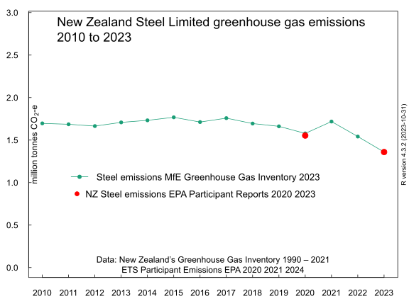
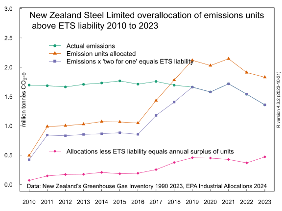
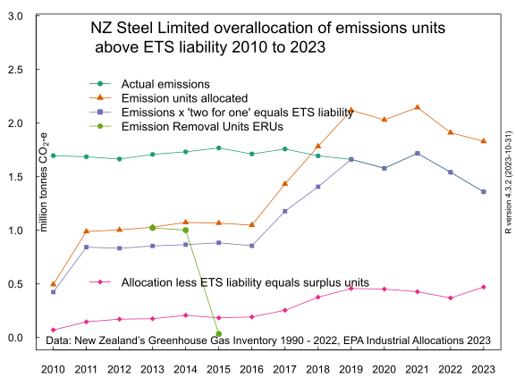

Should a major emitter like New Zealand Steel Limited be accumulating emissions units under the emissions trading scheme?

New Zealand Steel Limited free industrial allocation of emissions units 2010 to 2020

Every year since the New Zealand Emissions Trading Scheme (or "ETS") began, New Zealand Steel Limited has received more emissions units under the ETS Industrial Allocation rules then it has had to surrender to the Government for it's emissions.

Should the emissions trading scheme result in New Zealand Steel accumulating a stockpile of emissions units? In a sensibly designed emissions trading scheme, shouldn't the 'flow' of emissions units be from the emitter, New Zealand Steel, to the Government?

Here is a graph of the greenhouse gas emissions of the New Zealand steel sector from the Greenhouse Gas Inventory. The emissions do not vary much over time. I assume that is because production in the steel smelter is also consistent from year to year.

 

I know these emissions are from the New Zealand Steel Limited's steel smelting plant in Glenbrook as I looked up New Zealand Steel's actual emissions in the EPA report "ETS Participant Emissions" October 2021. New Zealand Steel's reported emissions are (steel 54,431 + stationary energy 762,038 + coal purchase 736,875 equals) 1,553,344 tonnes.

I have marked that data point with a purple circle. The 2020 GHG Inventory steel emissions are 1,578,554; the green circle. The purple and green data points overlap on the graph. So I think it's reasonable to use the GHG Inventory steel industry emissions as an estimate of New Zealand Steel's actual emissions from 1990 to 2020.

Here is the same graph but with the industrial allocation of free emissions units added.

The free emissions units don't seem to relate logically to the steel emissions. The free units seem to be roughly half of the emissions until 2016 then the free units increase anually until they are greater than the emissions in years 2018 2019 and 2020. What's going on?

There is another variable to take into account. It is the the Nick Smith '1 for 2' surrender obligation of 2009 which halved the unit surrender liability of emitters.

Prior to 2017, non-forestry participants in the ETS had to surrender one eligible unit for every two tonnes of emissions. A "one for two" deal. This discount was phased out from 2017; 1 unit for each 1.5 whole tonnes of emissions, 2018; - 1 unit for each 1.2 whole tonnes of emissions. And finally in 2019; the ETS gets to 1 unit for each 1 whole tonne of emissions.

So I need to factor in the discount to estimate the actual liability to surrender units under the Emissions Trading Scheme. That is steel emissions multiplied by a discount factor (0.25 units for a tonne of emissions in 2010, 0.5 for 2011 to 2016, 0.67 for 2017, 0.83 for 2018, 1 unit per tonne for 2019 and 2020). I have added the ETS liability in blue lines and square points

Well what do you know? The annual allocation of free emissions units always exceeds the ETS liability to surrender units. New Zealand Steel Limited has never had to surrender any emission units under the ETS. New Zealand Steel Limited is always a net seller of emissions units.

The rationalisation for the annual surplus of units over ETS liability is that New Zealand Steel Limited also faces an indirect emissions trading scheme carbon price on the electricity it consumes. So the only carbon price the New Zealand Steel is exposed to, is through it's electricity bills.

I think that this electricity ETS pass-through cost is an imaginary artefact. It can only be detected by 'modelling'; that is to say fiddling numbers on a spreadsheet. It is confused with coal fired generation setting the marginal cost of electricity in the wholesale market. I think it is implausible that a high-volume contract for electricity supply negotiated by a large corporate with market power includes any carbon price pass-through cost.

The next graph shows the annual excess or surplus of allocated emission units over the estimated number of emissions units actually surrendered back to the Government.

Back in 2016 I asked why does the Emissions Trading Register show that New Zealand Steel Limited own over 1 million emission reduction units (internationally sourced, bargain priced and probably fraudulent 'hot air' units) at the end of 2013 and 2014, given it never needed to buy emissions units to meet it's ETS obligations?

I argued New Zealand Steel would have surrendered the much cheaper "hot air" emission reduction units to the Government for its steel emissions and stockpiled the more valuable (and permanent in duration) NZUs (New Zealand Units).

Lets add the emission reduction units to our chart as teal green points (and lines) in 2013 and 2013.

The point being that these units just add to the growing 'stockpile' of units owned by New Zealand Steel. As in this chart where I have 'grayed out' the annual emissions, the allocations, the ETS surrender liability and the annual surplus of units. I have add the growing stockpile as the red line and resized the Y axis. The two biggest annual increases in the stockpile are 2013 and 2014 when New Zealand Steel had cheap ERUs as well as allocated NZUs.

If New Zealand Steel have used the cheaper ERUs for it's ETS liabilities and kept all surplus NZU emission units, they would own 4.7 million units at the end of 2020. This leaves out however many units New Zealand Steell was allocated in May 2021 and in May 2022. The 4.7 million units will have a current market value of $364 million based on a carbon price of $76.90

So my final question is: How can this be a sensible outcome from a policy intended to incentivise the reduction of greenhouse gas emissions? Instead, the emitter ends up with a financial asset making considerable capital gains. How is this possibly compatible with a net zero in 2050 policy?
